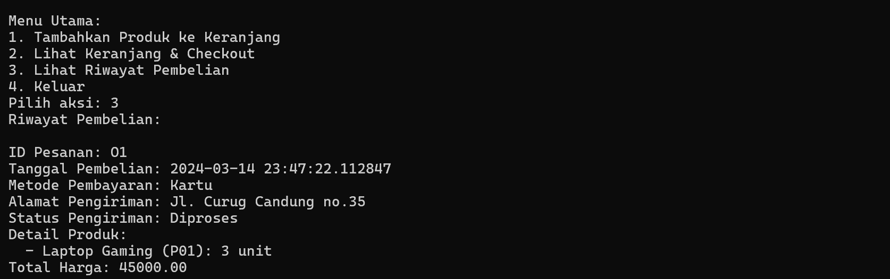

# TP1PROVIS2024

## Aplikasi E-Commerce Sederhana

Aplikasi E-Commerce Sederhana ini adalah contoh implementasi dasar dari sistem e-commerce yang memungkinkan pengguna untuk menjelajahi produk, menambahkan produk ke keranjang belanja, melakukan checkout, dan memberikan ulasan produk. Aplikasi ini dikembangkan menggunakan Dart, yang menunjukkan penggunaan konsep-konsep pemrograman seperti OOP (Object-Oriented Programming), asynchronous programming dengan async dan await, serta pengelolaan koleksi data.

## Fitur

Aplikasi ini memiliki fitur-fitur berikut:

Menjelajahi Produk: Pengguna dapat melihat daftar produk yang tersedia untuk dibeli.
Menambahkan Produk ke Keranjang Belanja: Pengguna dapat memilih produk dan menambahkannya ke keranjang belanja dengan jumlah tertentu.
Checkout: Setelah menambahkan produk ke keranjang, pengguna dapat melanjutkan ke proses checkout, memilih metode pembayaran, dan mengonfirmasi pembelian.
Memberikan Ulasan: Pengguna dapat memberikan ulasan dan rating untuk produk yang telah dibeli setelah proses pembayaran selesai.
Melihat Riwayat Pembelian: Pengguna dapat melihat riwayat pembelian mereka, termasuk detail pesanan dan status pengiriman.
Proses Bisnis
Alur proses bisnis dalam aplikasi ini mencakup beberapa tahapan utama:

### Menjelajahi dan Menambahkan Produk ke Keranjang

Saat aplikasi dijalankan, daftar produk akan ditampilkan dalam bentuk tabel yang menarik, termasuk informasi seperti ID produk, nama, deskripsi, harga, dan kategori.
Pengguna memasukkan ID produk dan jumlah yang diinginkan untuk menambahkan produk ke keranjang belanja. Sistem akan memeriksa ketersediaan stok sebelum menambahkannya ke keranjang.

### Checkout dan Pembayaran

Pengguna diberikan opsi untuk melihat isi keranjang belanja dan total harga sebelum melanjutkan ke pembayaran.
Saat melanjutkan ke pembayaran, pengguna diminta untuk memilih metode pembayaran (Kartu atau Transfer) dan mengonfirmasi pembelian.
Sistem akan mensimulasikan proses pembayaran (asumsi penggunaan gateway pembayaran eksternal) dan mengurangi stok produk yang dibeli.

### Memberikan Ulasan

Setelah pembayaran berhasil, pengguna diminta untuk memberikan ulasan dan rating untuk setiap produk yang dibeli.
Ulasan akan disimpan sebagai bagian dari riwayat pembelian, meskipun dalam implementasi demo ini hanya disimulasikan penyimpanannya.

### Melihat Riwayat Pembelian

Pengguna dapat memilih untuk melihat riwayat pembelian mereka, termasuk detail setiap pesanan, produk yang dibeli, metode pembayaran, dan ulasan yang diberikan.

## Implementasi Teknis

Aplikasi ini menggunakan Dart dan menjalankan operasi secara synchronous maupun asynchronous untuk mensimulasikan interaksi dengan sistem eksternal (seperti proses pembayaran).
Prinsip OOP digunakan untuk merancang struktur data dan interaksi antar objek, termasuk penggunaan inheritance (pewarisan) dan polymorphism.
Exception handling dan input validation diterapkan untuk meningkatkan keandalan aplikasi.

## Kelas dan Atribut

### Person (Kelas Abstrak)

id: String
nama: String
email: String

### Pengguna (Mewarisi Person)

alamatPengiriman: String
riwayatPembelian: List<Pesanan>

### Produk

id: String
nama: String
deskripsi: String
harga: double
kategori: String
gambarUrl: String
stok: int
rating: double

### ProdukElektronik (Mewarisi Produk)

garansi: String

### ProdukPakaian (Mewarisi Produk)

ukuran: String
bahan: String

### Keranjang Belanja

produk: Map<Produk, int>
totalHarga: double

### Pesanan

id: String
produk: Map<Produk, int>
totalHarga: double
statusPengiriman: String
tanggalPembelian: DateTime
metodePembayaran: String (menggunakan IPembayaran untuk polimorfisme)
alamatPengiriman: String

### IPembayaran (Interface)

prosesPembayaran()

### PembayaranKartu (Implementasi IPembayaran)

nomorKartu: String

### PembayaranTransfer (Implementasi IPembayaran)

bank: String

### ProductReview

id: String
produkId: String
penggunaId: String
rating: int
komentar: String
tanggal: DateTime

## Penutup

Terima kasih saya Muhamad Sabil Fausta dengan NIM 2210142 mohon maaf apabila terdapat kesalahan semoga bermanfaat
